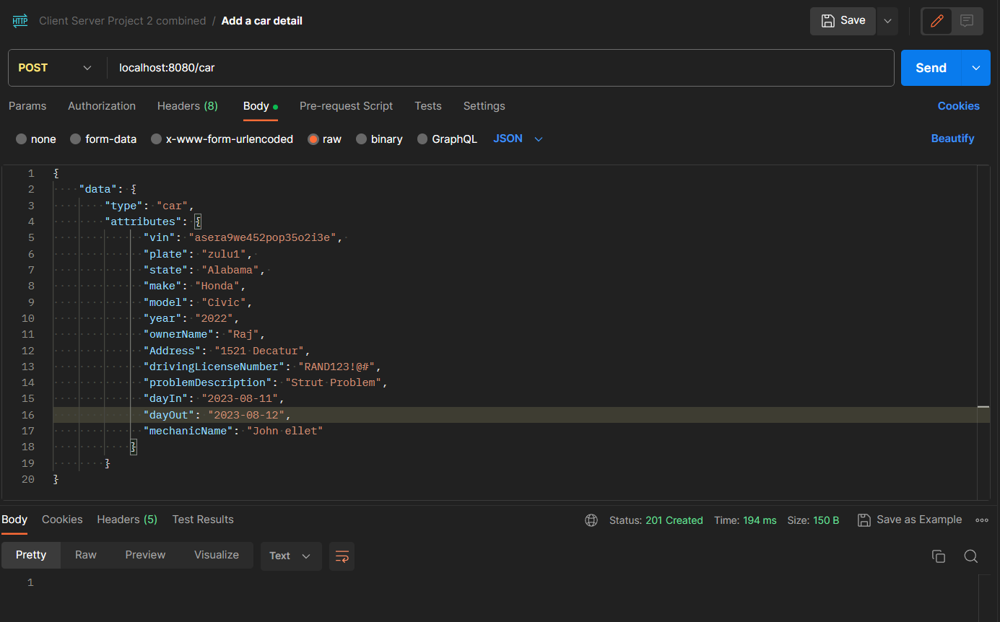
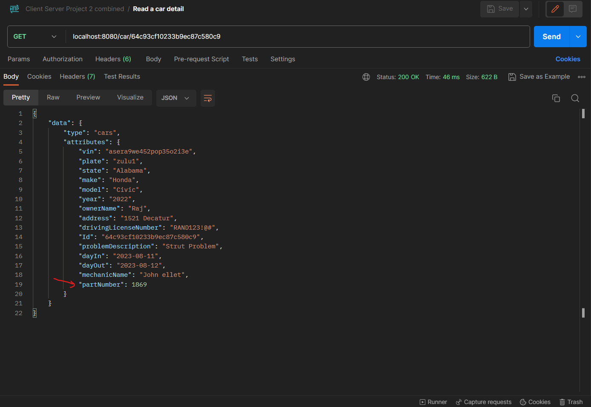
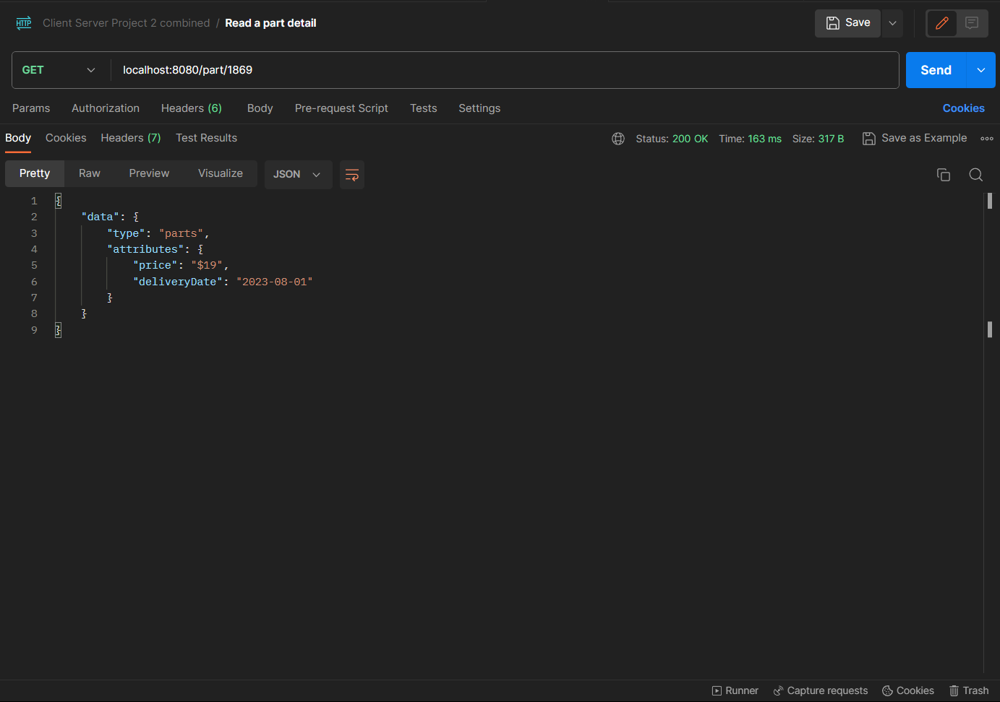

## DOCKER INSTRUCTIONS

1. `docker compose build` to build all services
2. `docker compose up` to run services

The service is available at `localhost:8080` port.\
Use the `ClientServerProject2combined.postman_collection` postman collection to test out the operations on the API.

Part-1 update: \
After the API is fed with the customer information and the problem of their vehicle, a `partNumber` is assigned which is needed for the repair. \
 The `partNumber` can be then used to get the estimated date and price for that vehicle part.

Example: \
1. Adding car and customer information:


2. Part number auto populated on the newly created record:



Part-2 of the project: \
To check the price of the vehicle part and its estimated delivery, use the url `http://localhost:8080/part/{partNumber}`:
```
curl -X GET --location "http://localhost:8080/part/12" \
     -H "Accept: application/json"
```

Example:
1. Using the part number, getting that part price and estimated delivery date (postman):

